  <picture>
    <source media="(max-width: 760px) and (prefers-color-scheme: dark)" srcset="./assets/hero/builder-profile-v2-mobile-dark.svg">
    <source media="(max-width: 760px)" srcset="./assets/hero/builder-profile-v2-mobile-light.svg">
    <source media="(prefers-color-scheme: dark)" srcset="./assets/hero/builder-profile-v2-dark.svg">
    <source media="(prefers-color-scheme: light)" srcset="./assets/hero/builder-profile-v2-light.svg">
    
  </picture>

## Hey, I'm Luqman

I am **Luqman Zahid Abdurrokhman**, a **Cyber Security Specialist** based in Sidoarjo, Indonesia. 

I focus on identifying vulnerabilities, securing system architectures, and analyzing threats to build resilient and impenetrable systems. My core interests lie at the intersection of:
- **Ethical Hacking & Penetration Testing**
- **Cloud & Infrastructure Security**
- **Incident Response & Digital Forensics**
- **Secure Software Development Life Cycle (Secure SDLC)**

---

<strong>Recent public activity</strong>

 

<!-- AUTO:ACTIVITY:START -->
_No recent public activity was found._
<!-- AUTO:ACTIVITY:END -->

---

  Securing systems, hardening infrastructure, and protecting digital assets.

